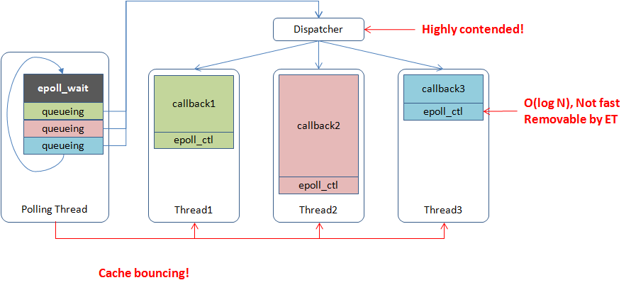

[中文版](../cn/threading_overview.md)

# Common threading models

## Connections own threads or processes exclusively

In this model, a thread/process handles all messages from a connection and does not quit or do other jobs before the connection is closed. When number of connections increases, resources occupied by threads/processes and costs of context switches becomes more and more overwhelming, making servers perform poorly. This situation is summarized as the [C10K](http://en.wikipedia.org/wiki/C10k_problem) problem, which was common in early web servers but rarely present today.

## Single-threaded [reactor](http://en.wikipedia.org/wiki/Reactor_pattern)

Event-loop libraries such as [libevent](http://libevent.org/), [libev](http://software.schmorp.de/pkg/libev.html) are typical examples. There's usually an event dispatcher in this model responsible for waiting on different kinds of events and calling the corresponding event handler **in-place** when an event occurs. After all handlers(that need to be called) are called, the dispatcher waits for more events again, which forms a "loop". Essentially this model multiplexes(interleaves) code written in different handlers into a system thread. One event-loop can only utilize one core, so this kind of program is either IO-bound or each handler runs within short and deterministic time(such as http servers), otherwise one callback taking long time blocks the whole program and causes high delays. In practice this kind of program is not suitable for involving many developers, because just one person adding inappropriate blocking code may significantly slow down reactivities of all other code. Since event handlers don't run simultaneously, race conditions between callbacks are relatively simple and in some scenarios locks are not needed. These programs are often scaled by deploying more processes. 

How single-threaded reactors work and the problems related are demonstrated below: (The Chinese characters in red: "Uncontrollable! unless the service is specialized")

## N:1 threading library

Also known as [Fiber](http://en.wikipedia.org/wiki/Fiber_(computer_science)). Typical examples are [GNU Pth](http://www.gnu.org/software/pth/pth-manual.html), [StateThreads](http://state-threads.sourceforge.net/index.html). This model maps N user threads into a single system thread, in which only one user thread runs at the same time and the running user thread does not switch to other user threads until a blocking primitive is called (cooperative). N:1 threading libraries are equal to single-threaded reactors on capabilities, except that callbacks are replaced by contexts (stacks, registers, signals) and running callbacks becomes jumping to contexts. Similar to event-loop libraries, a N:1 threading library cannot utilize multiple CPU cores, thus only suitable for specialized applications. However a single system thread is more friendly to CPU caches, with removal of the support for signal masks, context switches between user threads can be done very fast(100 ~ 200ns). N:1 threading libraries perform as well as event-loop libraries and are also scaled by deploying more processes in general.

## Multi-threaded reactor

[boost::asio](http://www.boost.org/doc/libs/1_56_0/doc/html/boost_asio.html) is a typical example. One or several threads run event dispatchers respectively. When an event occurs, the event handler is queued into a worker thread to run. This model is extensible from single-threaded reactor intuitively and able to make use of multiple CPU cores. Since sharing memory addresses makes interactions between threads much cheaper, the worker threads are able to balance loads between each other frequently, as a contrast multiple single-threaded reactors basically depend on the front-end servers to distribute traffic. A well-implemented multi-threaded reactor is likely to utilize CPU cores more evenly than multiple single-threaded reactors on the same machine. However, due to [cache coherence](atomic_instructions.md#cacheline), multi-threaded reactors are unlikely to achieve linear scalability on CPU cores. In particular scenarios, a badly implemented multi-threaded reactor running on 24 cores is even slower than a well-tuned single-threaded reactor. Because a multi-threaded reactor has multiple worker threads, one blocking event handler may not delay other handlers. As a result, event handlers are not required to be non-blocking unless all worker threads are blocked, in which case the overall progress is affected. In fact, most RPC frameworks are implemented in this model with event handlers that may block, such as synchronously waiting for RPCs to downstream servers.

How multi-threaded reactors work and problems related are demonstrated below:

## M:N threading library

This model maps M user threads into N system threads. A M:N threading library is able to decide when and where to run a piece of code and when to end the execution, which is more flexible at scheduling compared to multi-threaded reactors. But full-featured M:N threading libraries are difficult to implement and remaining as active research topics. The M:N threading library that we're talking about is specialized for building online services, in which case, some of the requirements can be simplified, namely no (complete) preemptions and priorities. M:N threading libraries can be implemented either in userland or OS kernel. New programming languages prefer implementations in userland, such as GHC thread and goroutine, which is capable of adding brand-new keywords and intercepting related APIs on threading. Implementation in existing languages often have to modify the OS kernel, such as [Windows UMS](https://msdn.microsoft.com/en-us/library/windows/desktop/dd627187(v=vs.85).aspx) and google SwicthTo(which is 1:1, however M:N effects can be achieved based on it). Compared to N:1 threading libraries, usages of M:N threading libraries are more similar to system threads, which need locks or message passings to ensure thread safety.

# Issues

## Multi-core scalability

Ideally capabilities of the reactor model are maximized when all source code is programmed in event-driven manner, but in reality because of the difficulties and maintainability, users are likely to mix usages: synchronous IO is often issued in callbacks, blocking worker threads from processing other requests. A request often goes through dozens of services, making worker threads spend a lot of time waiting for responses from downstream servers. Users have to launch hundreds of threads to maintain enough throughput, which imposes intensive pressure on scheduling and lowers efficiencies of TLS related code. Tasks are often pushed into a queue protected with a global mutex and condition, which performs poorly when many threads are contending for it. A better approach is to deploy more task queues and adjust the scheduling algorithm to reduce global contentions. Namely each system thread has its own runqueue, and one or more schedulers dispatch user threads to different runqueues. Each system thread runs user threads from its own runqueue before considering other runqueues, which is more complicated but more scalable than the global mutex+condition solution. This model is also easier to support NUMA.

When an event dispatcher passes a task to a worker thread, the user code probably jumps from one CPU core to another, which may need to wait for synchronizations of relevant cachelines, which is not very fast. It would be better that the worker is able to run directly on the CPU core where the event dispatcher runs, since at most of the time, priority of running the worker ASAP is higher than getting new events from the dispatcher. Similarly, it's better to wake up the user thread blocking on RPC on the same CPU core where the response is received.

## Asynchronous programming

Flow controls in asynchronous programming are even difficult for experts. Any suspending operation such as sleeping for a while or waiting for something to finish, implies that users have to save states explicitly and restore states in callbacks. Asynchronous code is often written as state machines. A few suspensions are troublesome, but still handleable. The problem is that once the suspension occurs inside a condition, loop or sub-function, it's almost impossible to write such a state machine being understood and maintained by many people, although the scenario is quite common in distributed systems where a node often needs to interact with multiple nodes simultaneously. In addition, if the wakeup can be triggered by more than one events (such as either fd has data or timeout is reached), the suspension and resuming are prone to race conditions, which require good multi-threaded programming skills to solve. Syntactic sugars(such as lambda) just make coding less troublesome rather than reducing difficulty.

Shared pointers are common in asynchronous programming, which seems convenient, but also makes ownerships of memory elusive. If the memory is leaked, it's difficult to locate the code that forgot to release; if segment fault happens, where the double-free occurs is also unknown. Code with a lot of referential countings is hard to remain good-quality and may waste a lot of time on debugging memory related issues. If references are even counted manually, keeping quality of the code is harder and the maintainers are less willing to modify the code. [RAII](http://en.wikipedia.org/wiki/Resource_Acquisition_Is_Initialization) cannot be used in many scenarios in asynchronous programming, sometimes resources need to be locked before a callback and unlocked inside the callback, which is very error-prone in practice.
