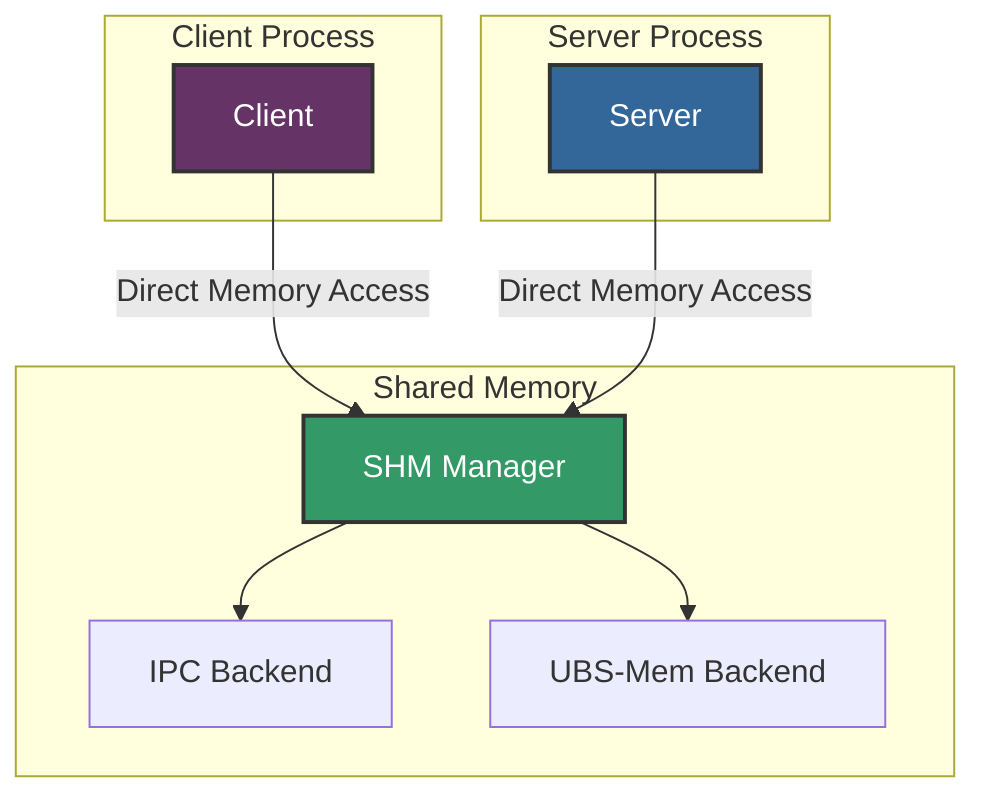

# UBRing: High-Performance Shared Memory RPC

UBRing is a high-performance RPC implementation in brpc that leverages shared memory for inter-process communication (IPC). It supports both local shared memory (POSIX IPC) and remote shared memory (ubs-mem), providing ultra-low latency communication between processes.

## Technical Background

Traditional RPC frameworks typically use network sockets for communication, which introduces significant overhead due to kernel involvement, context switches, and data copying. UBRing addresses this by using shared memory as the communication medium, allowing direct memory access between processes with minimal kernel intervention.

Key advantages of UBRing:
- **Ultra-low latency**: Microsecond-level RPC latency
- **High throughput**: Millions of RPC calls per second
- **Reduced data copying**: Direct memory access between processes
- **Cross-platform support**: Works on Linux and macOS

## Supported Shared Memory Backends

UBRing supports two types of shared memory backends, controlled by the `ub_shm_type` flag:

### 1. POSIX IPC Shared Memory (ub_shm_type = 1)

This is the default mode, using standard POSIX shared memory for local IPC. Processes on the same machine can communicate directly through shared memory regions.

### 2. UBS-Mem Remote Shared Memory (ub_shm_type = 2)

This mode uses ubs-mem (Unified Block Storage Memory), an open-source remote shared memory framework from openEuler. It enables shared memory communication across nodes in a rack, similar to RDMA but with simpler deployment requirements.

**UBS-Mem Open Source**: https://atomgit.com/openeuler/ubs-mem

**Required Libraries**:
- `libubsm_sdk.so` - UBS-Mem SDK library (installed at `/usr/local/ubs_mem/lib/libubsm_sdk.so`)
- UBS-Mem dynamically loads the library via `dlopen()` and uses functions like `ubsmem_initialize()`, `ubsmem_create_region()`, `ubsmem_shmem_allocate()`, `ubsmem_shmem_map()`, etc.

**UBS-Mem Key Functions**:
- `ubsmem_init_attributes()` - Initialize UBS-Mem attributes
- `ubsmem_initialize()` - Initialize UBS-Mem library
- `ubsmem_finalize()` - Finalize UBS-Mem library
- `ubsmem_create_region()` - Create a shared memory region
- `ubsmem_shmem_allocate()` - Allocate shared memory
- `ubsmem_shmem_map()` - Map shared memory to local address space
- `ubsmem_shmem_unmap()` - Unmap shared memory
- `ubsmem_shmem_deallocate()` - Deallocate shared memory
- `ubsmem_destroy_region()` - Destroy a shared memory region

### Future Expansion

The architecture is designed to support CXL (Compute Express Link) based remote shared memory in the future, enabling even more flexible distributed memory sharing.

## Build Configuration

### Build with CMake

To build brpc with UBRing support, use the following commands:

```bash
# Build brpc with UBRing support
cd /path/to/brpc
cmake -B build -DCMAKE_EXPORT_COMPILE_COMMANDS=ON -DWITH_UBRING:BOOL=ON
cmake --build build -j 8

# Build the ubring_performance example
cd /path/to/brpc/example/ubring_performance
cmake -B build
cmake --build build -j 8
```

### Build with Bazel

To build brpc with UBRing support using Bazel:

```bash
# Build brpc with UBRing support
cd /path/to/brpc
bazel build //... --define=with_ubring=true

# Build the ubring_performance example
bazel build //example/ubring_performance/...
```

### Select Shared Memory Backend

The shared memory backend is controlled by the `--ub_shm_type` flag:

```bash
# Use POSIX IPC (default)
./your_program --ub_shm_type=1

# Use UBS-Mem
./your_program --ub_shm_type=2
```

## Performance Testing

### Example: ubring_performance

brpc provides a performance test example at `example/ubring_performance/`.

#### Build the Example

```bash
cd example/ubring_performance
mkdir -p build && cd build
cmake ..
make
```

#### Run Server

```bash
# Run with POSIX IPC
./ubring_performance_server --ub_shm_type=1

# Run with UBS-Mem
./ubring_performance_server --ub_shm_type=2
```

#### Run Client

```bash
# Run with POSIX IPC
./ubring_performance_client --ub_shm_type=1 --server=127.0.0.1:8000

# Run with UBS-Mem
./ubring_performance_client --ub_shm_type=2 --server=<remote_ip>:8000
```

#### Test Options

| Option | Description | Default |
|--------|-------------|---------|
| `--ub_shm_type` | Shared memory type (1=IPC, 2=UBS-Mem) | 1 |
| `--server` | Server address | 127.0.0.1:8000 |
| `--thread_num` | Number of client threads | 1 |
| `--request_num` | Total requests per thread | 1000000 |
| `--timeout_ms` | Request timeout in milliseconds | 1000 |

## Architecture Overview



### Architecture Details

The UBRing architecture consists of:

1. **Client/Server Processes**: Application processes that communicate via shared memory
2. **SHM Manager**: Central manager for shared memory operations (`shm_mgr.cpp`)
3. **IPC Backend**: POSIX shared memory implementation for local communication
4. **UBS-Mem Backend**: Remote shared memory implementation for cross-node communication

## Implementation Details

### Shared Memory Management

The shared memory manager (`shm_mgr.cpp`) provides a unified interface for different shared memory backends:

- **Initialization**: `ShmMgrInit()` - Initializes the shared memory subsystem
- **Local Allocation**: `ShmLocalMalloc()` - Allocates shared memory for local use
- **Remote Allocation**: `ShmRemoteMalloc()` - Allocates shared memory accessible by remote nodes
- **Free**: `ShmFree()` - Releases shared memory resources

### Timer Management

UBRing uses a high-precision timer system (`timer_mgr.cpp`) for connection management and timeout handling, supporting both epoll (Linux) and kqueue (macOS).

## References

- [UBRing Feature Proposal](https://github.com/apache/brpc/issues/3226)
- [UBRing Technical Discussion](https://github.com/apache/brpc/discussions/3217)
- [UBS-Mem Open Source](https://atomgit.com/openeuler/ubs-mem)

## See Also

- [UB Client](ub_client.md) - Accessing UB services
- [RDMA Support](rdma.md) - Remote direct memory access