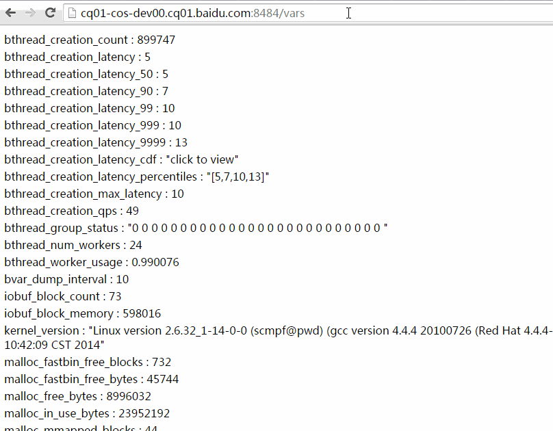
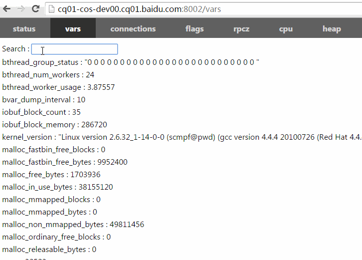
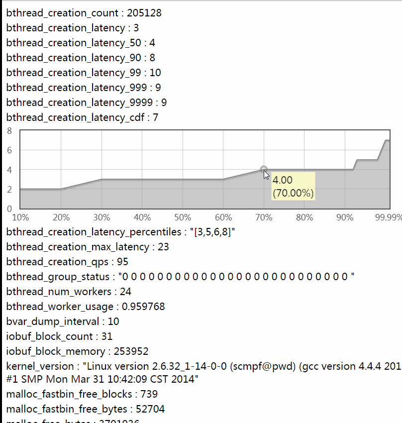
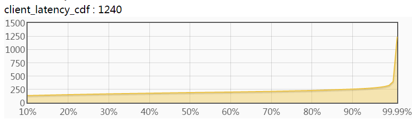
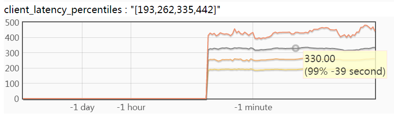
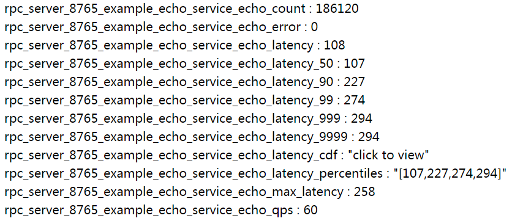
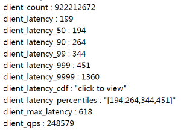

[中文版](../cn/vars.md)

[bvar](https://github.com/apache/brpc/tree/master/src/bvar/) is a set of counters to record and view miscellaneous statistics conveniently in multi-threaded applications. The implementation reduces cache bouncing by storing data in thread local storage(TLS), being much faster than UbMonitor(a legacy counting library inside Baidu) and even atomic operations in highly contended scenarios. brpc integrates bvar by default, namely all exposed bvars in a server are accessible through [/vars](http://brpc.baidu.com:8765/vars), and a single bvar is addressable by [/vars/VARNAME](http://brpc.baidu.com:8765/vars/rpc_socket_count). Read [bvar](bvar.md) to know how to add bvars for your program. brpc extensively use bvar to expose internal status. If you are looking for an utility to collect and display metrics of your application, consider bvar in the first place. bvar definitely can't replace all counters, essentially it moves contentions occurred during write to read: which needs to combine all data written by all threads and becomes much slower than an ordinary read. If read and write on the counter are both frequent or decisions need to be made based on latest values, you should not use bvar.

## Query methods

[/vars](http://brpc.baidu.com:8765/vars) : List all exposed bvars

[/vars/NAME](http://brpc.baidu.com:8765/vars/rpc_socket_count)：List the bvar whose name is `NAME`

[/vars/NAME1,NAME2,NAME3](http://brpc.baidu.com:8765/vars/pid;process_cpu_usage;rpc_controller_count)：List bvars whose names are either `NAME1`, `NAME2` or `NAME3`.

[/vars/foo*,b$r](http://brpc.baidu.com:8765/vars/rpc_server*_count;iobuf_blo$k_*): List bvars whose names match given wildcard patterns. Note that `$` matches a single character instead of `?` which is a reserved character in URL.

Following animation shows how to find bvars with wildcard patterns. You can copy and paste the URL to others who will see same bvars that you see. (values may change)



There's a search box in the upper-left corner on /vars page, in which you can type part of the names to locate bvars. Different patterns are separated by `,` `:` or space.



/vars is accessible from terminal as well:

```shell
$ curl brpc.baidu.com:8765/vars/bthread*
bthread_creation_count : 125134
bthread_creation_latency : 3
bthread_creation_latency_50 : 3
bthread_creation_latency_90 : 5
bthread_creation_latency_99 : 7
bthread_creation_latency_999 : 12
bthread_creation_latency_9999 : 12
bthread_creation_latency_cdf : "click to view"
bthread_creation_latency_percentiles : "[3,5,7,12]"
bthread_creation_max_latency : 7
bthread_creation_qps : 100
bthread_group_status : "0 0 0 0 0 0 0 0 0 0 0 0 0 0 0 0 0 0 0 0 0 0 0 0 0 0 "
bthread_num_workers : 24
bthread_worker_usage : 1.01056
```

## View historical trends

Clicking on most of the numerical bvars shows historical trends. Each clickable bvar records values in recent *60 seconds, 60 minutes, 24 hours and 30 days*, which are *174* numbers in total. 1000 clickable bvars take roughly 1M memory.



## Calculate and view percentiles

x-ile (short for x-th percentile) is the value ranked at N * x%-th position amongst a group of ordered values. E.g. If there're 1000 values inside a time window, sort them in ascending order first. The 500-th value(1000 * 50%) in the ordered list is 50-ile(a.k.a median), the 990-th(1000 * 99%) value is 99-ile, the 999-th value is 99.9-ile. Percentiles give more information on how latencies distribute than mean values, and being helpful for analyzing behavior of the system more accurately. Industrial-grade services often require SLA to be not less than 99.97% (the requirement for 2nd-level services inside Baidu, >=99.99% for 1st-level services), even if a system has good average latencies, a bad long-tail area may still break SLA. Percentiles do help analyzing the long-tail area.

Percentiles can be plotted as a CDF or percentiles-over-time curve.

**Following diagram plots percentiles as CDF**, where the X-axis is the ratio(ranked-position/total-number) and the Y-axis is the corresponding percentile. E.g. The Y value corresponding to X=50% is 50-ile. If a system requires that "99.9% requests need to be processed within Y milliseconds", you should check the Y at 99.9%.



Why do we call it [CDF](https://en.wikipedia.org/wiki/Cumulative_distribution_function) ? When a Y=y is chosen, the corresponding X means "percentage of values <= y". Since values are sampled randomly (and uniformly), the X can be viewed as "probability of values <= y", or P(values <= y), which is just the definition of CDF.

Derivative of the CDF is [PDF](https://en.wikipedia.org/wiki/Probability_density_function). If we divide the Y-axis of the CDF into many small-range segments, calculate the difference between X values of both ends of each segment, and use the difference as new value for X-axis, a PDF curve would be plotted, just like a normal distribution rotated 90 degrees clockwise. However density of the median is often much higher than others in a PDF and probably make long-tail area very flat and hard to read. As a result, systems prefer showing distributions in CDF rather than PDF.

Here're 2 simple rules to check if a CDF curve is good or not:

- The flatter the better. A horizontal line is an ideal CDF curve which means that there're no waitings, congestions or pauses, very unlikely in practice.
- The area between 99% and 100% should be as small as possible: right-side of 99% is the long-tail area, which has a significant impact on SLA.

A CDF with slowly ascending curve and small long-tail area is great in practice. 

**Following diagram plots percentiles over time** and has four curves. The X-axis is time and Y-axis from top to bottom are 99.9% 99% 90% 50% percentiles respectively, plotted in lighter and lighter colors (from orange to yellow). 



Hovering mouse over the curves shows corresponding values at the time. The tooltip in above diagram means "The 99% percentile of latency before 39 seconds is 330 **microseconds**". The diagram does not include the 99.99-ile curve which is usually significantly higher than others, making others hard to read. You may click bvars ended with "\_latency\_9999" to read the 99.99-ile curve separately. This diagram shows how percentiles change over time, which is helpful to analyze performance regressions of systems.

brpc calculates latency distributions of services automatically, which do not need users to add manually. The metrics are as follows:



`bvar::LatencyRecorder` is able to calculate latency distributions of any code, as depicted below. (checkout [bvar-c++](bvar_c++.md) for details):

```c++
#include <bvar/bvar.h>

...
bvar::LatencyRecorder g_latency_recorder("client");  // expose this recorder
... 
void foo() {
    ...
    g_latency_recorder << my_latency;
    ...
}
```

If the application already starts a brpc server, values like `client_latency`, `client_latency_cdf` can be viewed from `/vars` as follows. Clicking them to see (dynamically-updated) curves:



## Non brpc server

If your program only uses brpc client or even not use brpc, and you also want to view the curves, check [here](../cn/dummy_server.md).
