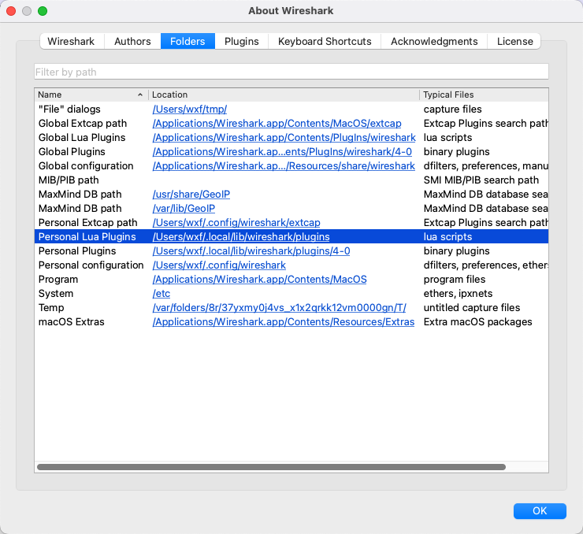

[中文版](../cn/wireshark_baidu_std.md)

# Overview

`wireshark_baidu_std.lua` is a Wireshark Lua dissector written for [`baidu_std`](../cn/baidu_std.md) protocol, including the [`streaming_rpc`](streaming_rpc.md) protocol.

Example for the Echo request:

Example for the Echo response:

## How to use

1. Put [`wireshark_baidu_std.lua`](../../tools/wireshark_baidu_std.lua) under "Personal Lua Plugins"；
1. And put [`options.proto`](../../src/brpc/options.proto), [`streaming_rpc_meta.proto`](../../src/brpc/streaming_rpc_meta.proto) and [`baidu_rpc_meta.proto`](../../src/brpc/policy/baidu_rpc_meta.proto) in `protobuf` directory under "Personal configuration", create if not exist；
1. Set `Protobuf Search Paths` for Protobuf official library include directory(e.g. `/opt/homebrew/opt/protobuf/include`), see [Wireshark Protobuf](https://wiki.wireshark.org/Protobuf#protobuf-search-paths-settings) for more details.
   
1. Optional, turn on `Dissect Protobuf fields as Wireshark fields` if you want to use related `baidu_std` fields for filtering:
   

The "Personal Lua Plugins" and "Personal configuration" folders above can be found under the `Folders` page of `About Wireshark`, for macOS:

